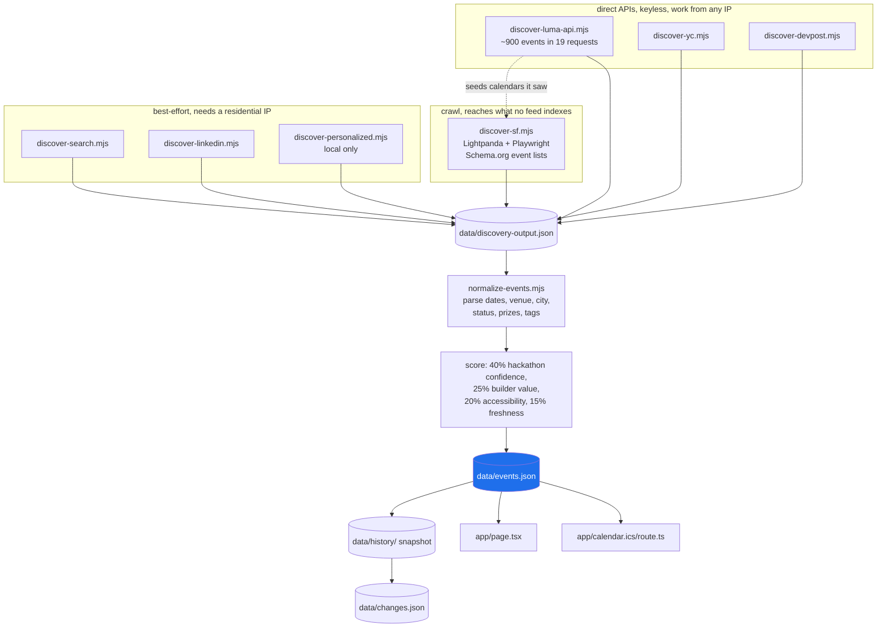

# Hacklist SF

Public hackathons in the SF Bay Area - including externally hosted events
linked from Luma calendars - discovered automatically, ranked by signal, and
published as a subscribable calendar.

- **Site:** https://hacklist-sf.modern-renaissance-artifacts.workers.dev
- **Calendar feed:** https://hacklist-sf.modern-renaissance-artifacts.workers.dev/calendar.ics
  (add this URL to Google/Apple/Outlook Calendar to subscribe)

## How it works

Seven sources feed one classifier. None of them costs anything, and none needs an
API key.

**Direct APIs - keyless, structured, and they work from any IP.** These are the
reliable core.

1. `scripts/discover-luma-api.mjs` reads Luma's public discover feed
   (`api.lu.ma/discover/get-paginated-events`) - around 900 upcoming Bay Area
   events in 19 requests and ten seconds. It also hands back exact times, guest
   counts and registration state for events the other passes found by reading a
   page, and reports which calendars it saw hosting a hackathon so the crawl can
   seed itself.
2. `scripts/discover-yc.mjs` reads Y Combinator's own events site, which hosts a
   steady stream of Bay Area hackathons that never appear on Luma.
3. `scripts/discover-devpost.mjs` reads Devpost's public hackathon API.

**Crawl - reaches what no feed indexes.**

4. `scripts/discover-sf.mjs` sweeps public Luma surfaces with a headless browser
   (Lightpanda + Playwright), starting from the seeds in `config/discovery.json`
   plus whatever calendars the API pass discovered, and expanding through event,
   organizer and co-host links. It reads Schema.org event lists embedded in
   public calendar pages and follows direct external event links. Raw candidates
   land in `data/discovery-output.json`.

**Best-effort - extras that depend on a residential IP.**

5. `scripts/discover-search.mjs` asks a search engine for events no calendar
   links to.
6. `scripts/discover-linkedin.mjs` reads public LinkedIn posts and articles for
   hackathons announced to a network rather than published to a calendar.
7. `scripts/discover-personalized.mjs` collects the events Luma recommends a
   signed-in account (local only; see below).

**Then:** `scripts/normalize-events.mjs` parses each candidate into a structured
record (dates, venue, city, status, prizes, tags), scores it (40% hackathon
confidence, 25% builder value, 20% accessibility, 15% freshness) and writes
`data/events.json`. Every sweep is snapshotted to `data/history/` and diffed into
`data/changes.json`. The site (`app/page.tsx`) and the ICS feed
(`app/calendar.ics/route.ts`) are generated from `data/events.json`.

Why the Luma API and the Luma crawl both run, rather than the API replacing the
crawl: they find different things, measured rather than assumed. The API surfaced
4 hackathons the crawl had missed; the crawl had 8 the API's feed never returned,
because they live on organizer calendars the feed does not surface. Dropping
either would cost coverage.

### The sweep, end to end



The API pass and the crawl both run because they find different things, measured
rather than assumed: the API surfaced 4 hackathons the crawl missed, the crawl had
8 the feed never returned.

## Deploying it

The site and the ICS feed are one Cloudflare Worker, configured in
`wrangler.jsonc` with `ASSETS` and `IMAGES` bindings.

```bash
npm install
npm run dev          # local worker
npm run build
npm run deploy       # vinext deploy, to Cloudflare
```

The discovery passes are separate from the deploy: they write `data/events.json`,
which is committed, and the Worker serves whatever is in it. That split is why the
site never depends on a scraper being up, and why the best-effort passes can be
skipped in CI without breaking the build. See **Automation** below for the schedule
and **Local passes** for what must never run in CI.

## Reliability

Every discovery pass is built never to fail - a throttled search or a dead
endpoint writes an empty file and exits 0, because a partial sweep beats no
sweep. That design has two failure modes, and both are now covered.

**It can publish nothing.** A network outage mid-run once left every source with
zero results and the normalizer replaced the whole board with an empty list,
reporting success. It now refuses: a collapse to below `collapseRatio` of the
last good sweep (or below `minPublishedEvents`) leaves `data/events.json`
untouched and exits non-zero. The board keeps serving the last good data and the
run goes red.

**It can go quiet without telling anyone.** `npm run check:sources` reads what
each pass wrote and fails when the shape of the output says a source is broken
rather than merely quiet - an empty Luma feed, a YC index with no events, a sweep
that visited almost no pages, a board below its floor, or any pass whose output
has gone stale. It runs last in CI, *after* the deploy, so a broken source never
blocks the board from updating; it just turns the run red. Sources that depend on
a residential IP warn instead of failing, because they are expected to come back
empty from a datacenter.

Tests come in two kinds, and only one of them gates a deploy.

`npm run test:artifact` asks whether the thing about to be published is correct  - 
the rendered board, the ICS feed, the date arithmetic most likely to publish
something wrong (Devpost's date-only ranges, Y Combinator's placeholder
timestamps), the duplicate-collapsing rules and the calendar sync's decisions. 63
tests, three seconds, and CI runs it between the commit and the deploy.

`npm run test:browser` drives the real Add-External-Event form filler against a
local fixture that reproduces the behaviours which actually broke: a date field
that mis-parses its own display format, out-of-year dates shown differently, a
picker overlay that swallows clicks, an Escape key that closes the whole dialog,
and time fields Luma refills server-side. It needs Chrome and takes a minute and a
half, and it runs *after* the deploy - a flaky browser must not be able to
withhold a correct board.

See `PROTOTYPE.md` for the full product spec.

## Is another metro worth a region?

`npm run measure:regions` counts hackathons starting in the next 60 days across
seven metros, asking Luma, Eventbrite, Meetup, Devpost and MLH separately and
then deduping. Read-only, keyless, and it writes nothing.

It reports per source on purpose. The first attempt at this question asked only
Luma, which is an SF company whose home market adopted it first, so it flattered
San Francisco and said little about anywhere else. Splitting by source is what
tells you whether a metro's count is real or is one platform's popularity in one
city: New York's six are spread across four sources, while Seattle's three are
all recurring hack nights on Meetup.

It counts titles rather than pages, so it is an upper bound. The board's own
classifier reads the page and rejects most of what this admits: "Weekly
Write-a-thon" matches the `-a-thon` shape and is not a hackathon. Treat the
numbers as a ranking, not an inventory, and read the named results underneath.

As of August 2026, per 60 days and quality-adjusted by hand: Bay Area 8-12,
SoCal 3-4 (which is only visible if Los Angeles and San Diego are counted as one
region), New York 2-3, Austin 2, Seattle and Boston 0.

## Local passes (never run in CI)

Two steps need a signed-in Luma session, so they run on your machine against a
dedicated Chrome profile in `.local-browser-profile/` (gitignored). The session
never leaves this machine and is never placed in GitHub Actions.

```bash
bash scripts/install-luma-schedule.sh   # run the local passes at 8:30pm (installed)
bash scripts/install-wake-schedule.sh   # let them fire with the lid shut (sudo, once)
bash scripts/local-passes.sh            # or run them now, by hand

npm run discover:personalized           # just the personalized pass
npm run luma:queue                      # what's pending for the Luma calendar
npm run luma:sync -- --name "HackList SF"
```

`scripts/local-passes.sh` is what the schedule runs, once a day at 8:30pm:
LinkedIn and personalized discovery (which commit and push their seeds so the
next GitHub sweep crawls them), then the calendar sync and the tagging pass. No
step can abort another, and the log lands in `logs/local-passes.log`.

Once a day rather than twice: the sync is idempotent and the calendar only
changes when the board does, so the second run mostly re-confirmed the first.
Evening because the 8pm sweep finishes just before it - the sync publishes that
sweep, and the seeds it pushes are waiting for the 8am one to crawl.

launchd does not skip a missed run, so a sleeping Mac means the pass lands late
rather than never. `scripts/install-wake-schedule.sh` makes it land on time: it
sets a repeating wake one minute before the run and grants a narrow sudoers rule
so each run can re-arm the next. Worth knowing that a scheduled wake is far more
reliable on power than on battery.

The first run opens Chrome and waits for you to sign in by hand; later runs
reuse the profile. Personalized discovery writes only public event URLs to
`data/personalized-seeds.json`, which the anonymous crawler then classifies
like any other find - being recommended is not evidence of anything. It also
stores each card's title, which the sweep uses to visit hackathon-looking
events before general ones, so a feed of 141 mostly-unrelated events cannot
crowd out the ones worth having.

`luma:sync` drives Luma's supported **Add Event** admin UI (paste an event URL)
on a free calendar, so no Luma Plus subscription is required. It processes the
whole pending batch, marks an event synced only after seeing it on the
calendar, and stops without losing queue state if it hits a CAPTCHA, a
sign-out, or a UI it does not recognize. `data/luma-ledger.json` tracks what
has been added; `npm run luma:queue` prints a paste-by-hand fallback list.

## Search discovery

Everything else reaches events by crawling outward from calendars we already
know, so a hackathon nobody curates stays invisible. `npm run discover:search`
asks a search engine instead and writes event URLs to
`data/search-seeds.json`, which the crawler then visits and classifies like any
other find - a search hit is not evidence.

**No API key is required.** Firing the whole query list at once is what got the
keyless endpoint blocked, so each run takes only `searchQueriesPerRun` queries
and rotates which ones, advancing every 12 hours to match the schedule. The full
list is therefore covered every few runs with no throttling.

### Making search work in CI

Search engines block datacenter IPs, and GitHub Actions is a datacenter. That is
why the keyless path returns 403 or an empty page from CI however politely it
asks - it is not a rate limit you can wait out. The direct APIs carry the board
precisely so this does not matter, but if you want the search legs working in CI
too, set one of these (in provider precedence order):

- `BRIGHTDATA_API_KEY` (+ optional `BRIGHTDATA_SERP_ZONE`, default `serp_api`)  - 
  the one that actually solves the datacenter problem, since unblocking is what
  the product is for. Free tier is 5,000 credits/month, no credit card, and both
  search passes together spend a few hundred. **Wired but untested** - there is no
  account behind it here, so treat the first run as the real test; a wrong
  response shape is recorded in `problems` rather than thrown.
- `SERPER_API_KEY` or `TAVILY_API_KEY` - free tiers, no card.
- `BRAVE_API_KEY` - Brave now bills new accounts.

Search never blocks the sweep: a run with no search results still publishes.

Note that search engines mostly index the archive, so many hits are events that
have already happened. Those are rejected by the past-event filter, and stale
seeds are pruned after `searchSeedRetentionDays` so they stop costing crawl
budget.

## LinkedIn discovery

Search discovery can only find an event once a search engine has indexed its
registration page. A lot of Bay Area hackathons are announced first - sometimes
only - as a LinkedIn post, and the registration link sits in the post body or in
the author's own first comment. `npm run discover:linkedin` goes after those and
writes `data/linkedin-seeds.json`, which the crawler visits and classifies like
any other find.

Two stages, and by default neither costs anything:

1. **Search** for LinkedIn pages about Bay Area hackathons, using whichever
   provider is available (`SERPER_API_KEY`, `TAVILY_API_KEY`, `BRAVE_API_KEY`,
   else keyless DuckDuckGo).
2. **Read** each of those pages over plain HTTPS, free and keyless. LinkedIn
   serves post bodies, article bodies and top comments to an anonymous reader,
   so no login, cookie or session is involved - and none is stored.

A weekly "Bay Area AI events" digest can carry fifty Luma links of which three
are hackathons, so each extracted link keeps the words around it: links whose
context names a hackathon format are marked `promising` and crawled first, and
the cap trims the filler rather than the finds.

There is an optional paid escalation - a per-call LinkedIn search over
[Zero](https://www.zero.xyz) (x402, no signup, ~$0.003 a query) - for when the
free provider comes back empty. **It is off by default** (`linkedinMaxPaidQueriesPerRun: 0`),
because the board is meant to cost nothing, and because that capability answered
502 on roughly a third of calls and charged for them anyway. Turn it on by
raising that config value or setting `LINKEDIN_PAID_QUERIES=n`; `check:sources`
warns if anything was ever spent. Override the provider choice with
`LINKEDIN_SEARCH_PROVIDER=zero|serper|tavily|brave|duckduckgo-html`.

Note that search engines block datacenter IPs, so both this pass and
`discover:search` are expected to return nothing from GitHub Actions and to work
from the local schedule. That is why they are extras rather than load-bearing:
the direct APIs above carry the board.

## Devpost discovery

`npm run discover:devpost` reads `devpost.com/api/hackathons` - public, keyless,
paginated. Coverage is narrower than the volume suggests and honestly so: of ~80
upcoming in-person hackathons worldwide only a handful are Bay Area, and Devpost's
location field is free text an organizer typed. Sometimes it is a city, sometimes
a region ("Bay Area"), sometimes only a venue ("AWS Builder Loft"). Venue-only
strings cannot be placed without guessing, so they are skipped and listed in
`skipped.unplaceable` rather than assigned to a city we made up.

Devpost publishes submission-period dates and no clock times, so its events are
date-only: the span runs local midnight to end-of-day, which trips the "time we
do not believe" guard and prints the date without a time.

## Y Combinator discovery

YC runs a lot of Bay Area hackathons on its own events site and never puts them
on Luma, so the rest of the pipeline was blind to them - the sweep crawls
outward from Luma calendars, and search discovery only accepts Luma permalinks.
That is how Greptile's second Fast Hackathon (at YC, 23 Aug 2026) stayed off the
board while it was open for applications.

`npm run discover:yc` fixes that. `events.ycombinator.com` is a client-rendered
Inertia app - fetching it plainly gets an empty shell, which is why the headless
sweep cannot read it either - but Inertia ships its props in a `data-page`
attribute, so the events arrive as clean structured JSON. No browser, no key, no
third-party scraper. Output is `data/yc-candidates.json` in the same candidate
shape the sweep writes, merged by the normalizer and scored on the same terms.

One wrinkle worth knowing: YC's own `starts_at` is often a placeholder. An
organizer enters a date and the record lands at local midnight with a
three-hour duration while the description says "Sunday August 23rd 12pm-6pm".
So the calendar date is taken from YC and the clock time is recovered from the
description when YC's is not credible; `structuredEvent.timeSource` records
which happened (`yc`, `description`, or `yc-unverified`), and an unverified time
is suppressed by the normalizer rather than published.

## Automation

`.github/workflows/discover.yml` runs the whole loop at exactly 8am and 8pm
Pacific (DST-aware): all sources → normalize → commit data → deploy → check
source health.

The health check runs last, deliberately after the deploy: a broken source should
never stop the board from updating, it should just make the run red. A collapse is
handled earlier and differently - the normalizer refuses to publish it at all, so
the commit and deploy steps never run and the live board keeps its last good data.

Repository secrets:

- `CLOUDFLARE_API_TOKEN` - enables the deploy step (Workers Scripts: Edit
  permission). Without it, runs still refresh the committed data.
- `LUMA_API_KEY` (optional) - calendar-scoped key from a Luma Plus calendar;
  enables `scripts/sync-luma-calendar.mjs`, which submits each discovered
  event to that Luma calendar so people can follow Hacklist SF on Luma too.

## Commands

```bash
npm run dev                # local development
npm run discover:sf        # every source, then normalize
npm run discover:luma-api  # just Luma's public discover feed
npm run discover:yc        # just the Y Combinator pass
npm run discover:devpost   # just the Devpost pass
npm run discover:linkedin  # just the LinkedIn pass
npm run normalize          # re-normalize existing discovery output only
npm run check:sources      # are all the sources still working?
npm test                   # everything, including the browser-driven form test
npm run test:artifact      # the deploy gate: is the published artifact correct?
npm run test:browser       # drives the Luma form filler against a local fixture
npm run deploy             # build, then deploy to Cloudflare Workers
```

## Guardrails

Discovery only reads public event pages. It does not bypass CAPTCHAs, does
not collect attendee information, and rate-limits itself to a small page
budget per sweep.

The LinkedIn pass holds to the same line. It reads only what LinkedIn serves an
anonymous reader, stores no login or cookie, and keeps nothing about people  - 
what it extracts from a post is event URLs and the words around them. Paid
LinkedIn capabilities that return attendee, liker or commenter lists exist and
are not used.
